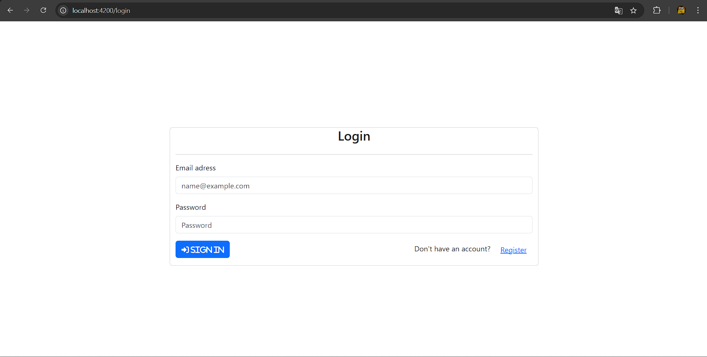
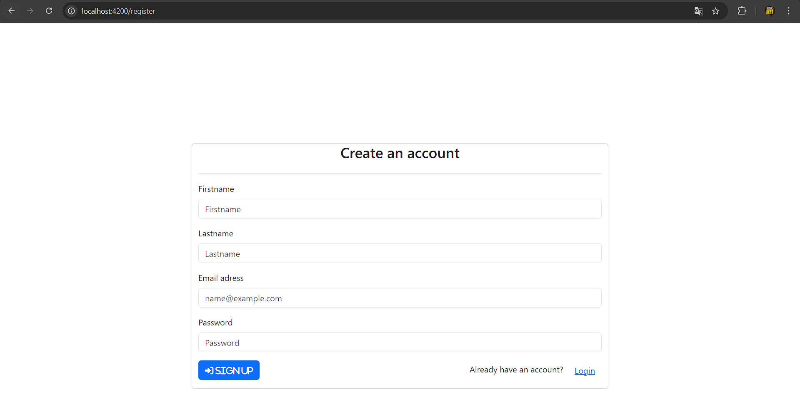
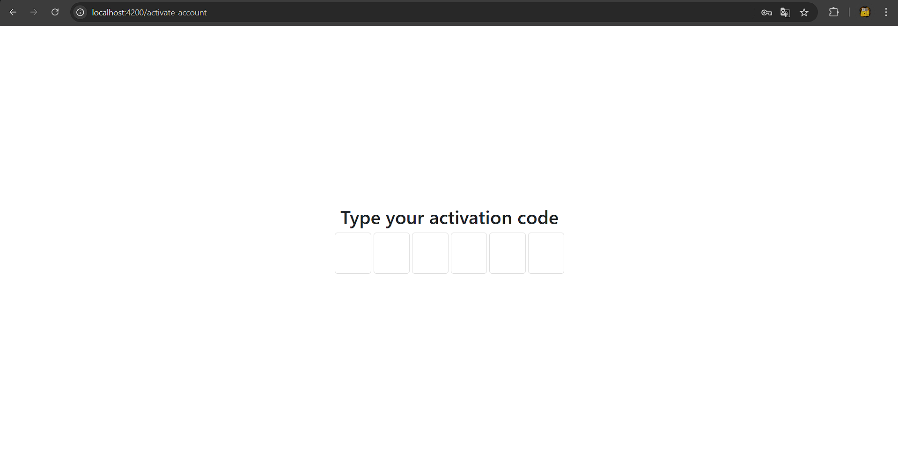

# 🛡️ Secure Login & Registration System

Welcome to the **Secure Login & Registration System**! This project is a robust and scalable authentication system built with Angular for the frontend and Spring Boot for the backend.

## ✨ Features

- 🔐 **Secure Login**: Authenticated user access with JWT tokens.
- 📋 **User Registration**: Easily create a new account with validation.
- 👤 **User Profile**: Login, Register and Verification.
- 📊 **UI**: Starter level UI, I mostly focused on functions and backend.
## 📸 Screenshots

| Login Page                      | Registration Page               | Verification                     |
|---------------------------------|---------------------------------|--------------------------------|
|  |  |  |

## 🛠️ Built With

- **Frontend**: [Angular](https://angular.io/)
- **Backend**: [Spring Boot](https://spring.io/projects/spring-boot)
- **Database**: [MySQL](https://www.postgresql.org/)

